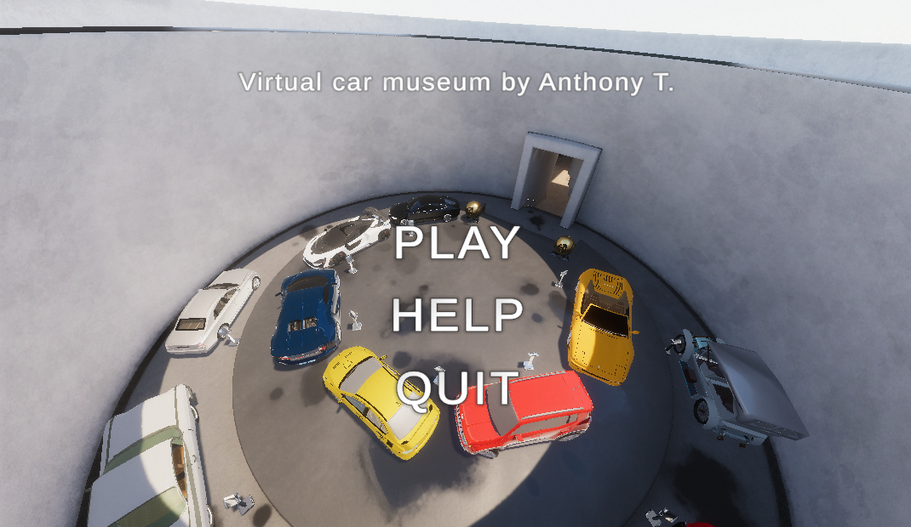
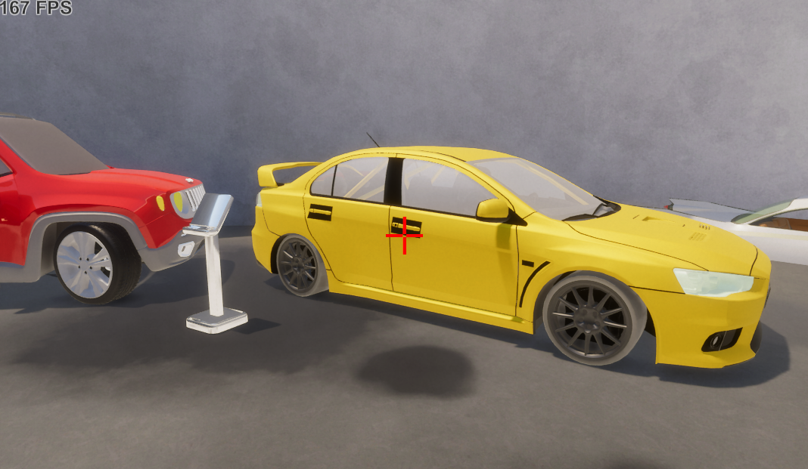
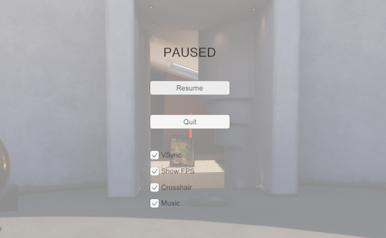
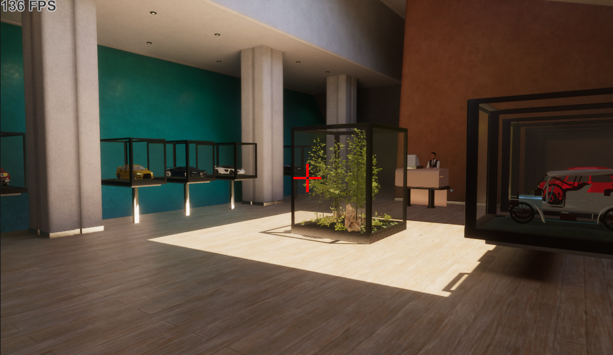
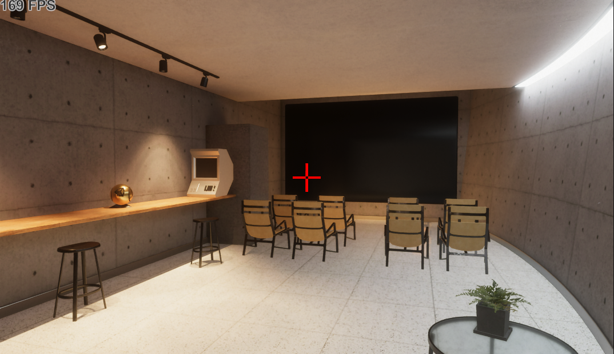

# Car Museum (features and project description)

This is a 3D rendered car museum, created with the Unity engine. It uses the HDRP rendering pipeline, for high fidelity visuals.

It contains many types of cars and from different eras (really old ones, and brand new ones). The user/player is able to virtually purchase miniatures of the cars, in a souvenir shop, while there is also a cinema room with 2 available movies to watch.

# Source code and assets of the project
<b> In this repository, only the C# scripts of the application are included </b>

The entier Unity project can be found on my Google Drive (Its a 2GB rar archive, that could not be uploaded to this repository)

[Unity project link](https://drive.google.com/file/d/1gmP5FzI9voKk51Glg7BP6ssDIYTZU_YE/view?usp=sharing)

# System requirements

To run the application, you must have a GPU that supports shader model 5.0, in other words, it must support DX11 (this high requirement is due to the fact that the project uses HDRP instead of standard rendering pipeline). Other than that, a modern quad core CPU and 8GB of ram should suffice. The included release is for Windows 10/11, but you can compile the project for Linux/MacOSX if you so wish.

<b> In summary : </b>
- GPU that supports Shader Model 5.0 and DX11
- Modern quad core CPU (i5 4th gen or better/ryzen 3 1st gen or better)
- 8GB of RAM
- 1GB of storage
- Windows 10/11 or MacOSX or Linux

# Estimated performance and known issues

The application was tested on Windows 11, with an RTX 3080 and i9 12900K CPU, and 16 GB of DDR4 4000MHZ CL 16 RAM.

The performance fluctuated between 140 fps on the most demanding scene (viewing the showcase area while being at the souvenir shop) and 400 fps while viewing a non-demanding scene.

The application was also tested on M1 apple sillicon MacBook Pro 2021, with 16GB of RAM.

Performance fluctuated between 25 fps on the most demanding area, and 40 fps on non demanding scenes.

The "demanding" area is a known issue that is caused by rendering all the cars + the miniature cars through walls, it may be patched in a future release.

# Assets origin
All the assets are free 3D models from turbosquid.com and open3d.com, and the music and videos for the cinema are youtube videos that have no copyright infrigment.

# Requirements for compiling the project

To compile this application, you must have <b>Unity version 2020.3.30f1</b> or newer.

Other versions may work aswell, <b>but they have not been tested</b>.

You may also need Blender and Autocad 3DS Max (for editing and opening the game assets.)

Blender is free, but 3DS Max is free only if you are a student.

You may compile this for either Windows, Mac or Linux platforms. However, the application was only tested on Windows 11 and Mac OS Big Sur running on M1 apple sillicon.

# Included releases

In case you dont have the tools to compile the project, yet you want to try it, there is a Windows 64-bit build.

[Windows 64-bit Build](https://drive.google.com/file/d/1Qc9xqnknBQYwUmKXMdkB8vtUdPjw4TT1/view?usp=sharing)

# Framerate vertical sync

To remove the Vertical sync (VSYNC) that caps your framerate to your monitor's refresh rate, open the pause menu using ESC (while in game) and uncheck the VSYNC option.

# Gameplay pictures

